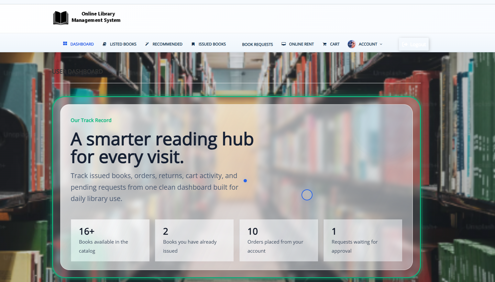
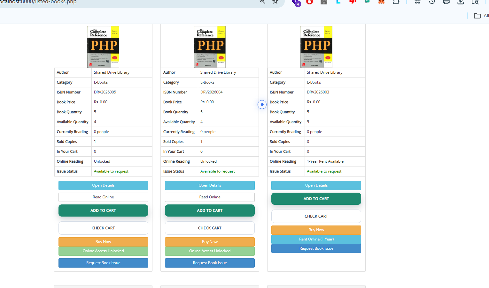
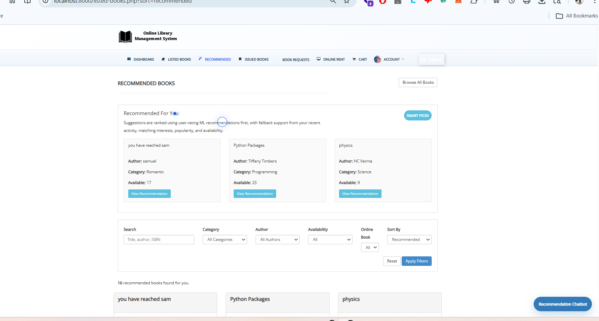
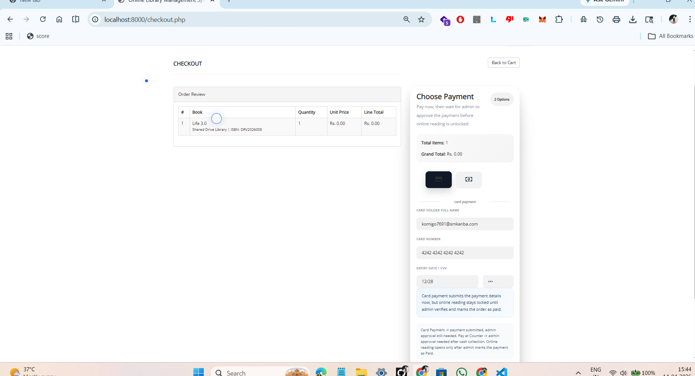
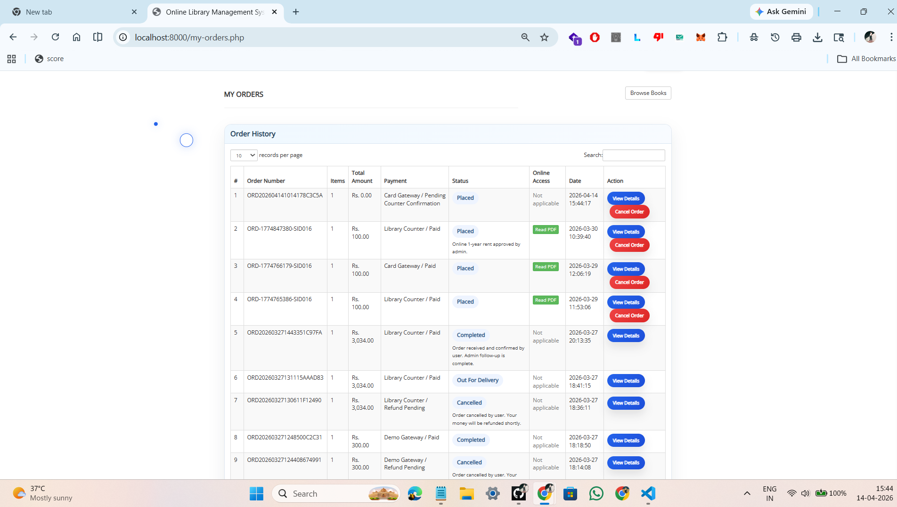
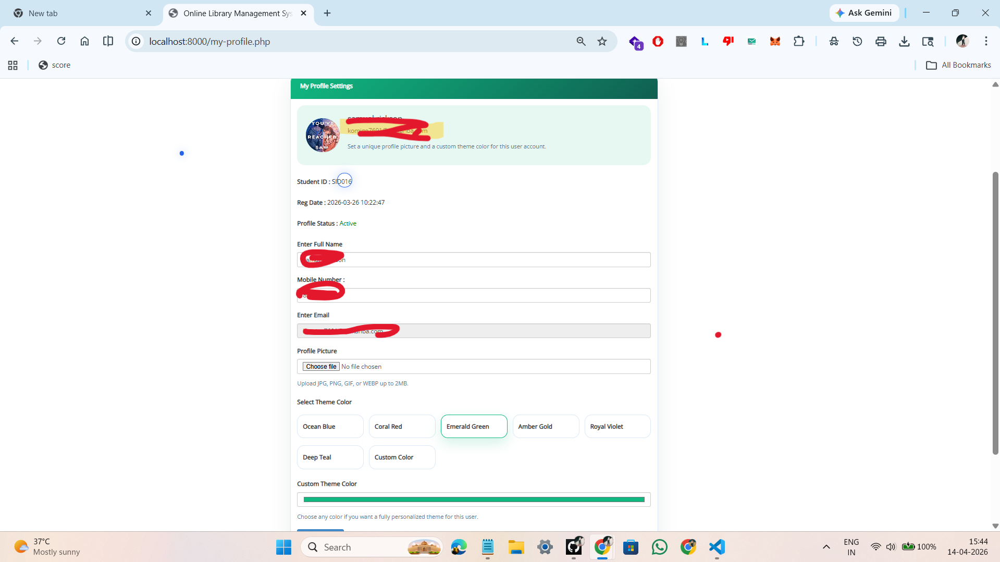
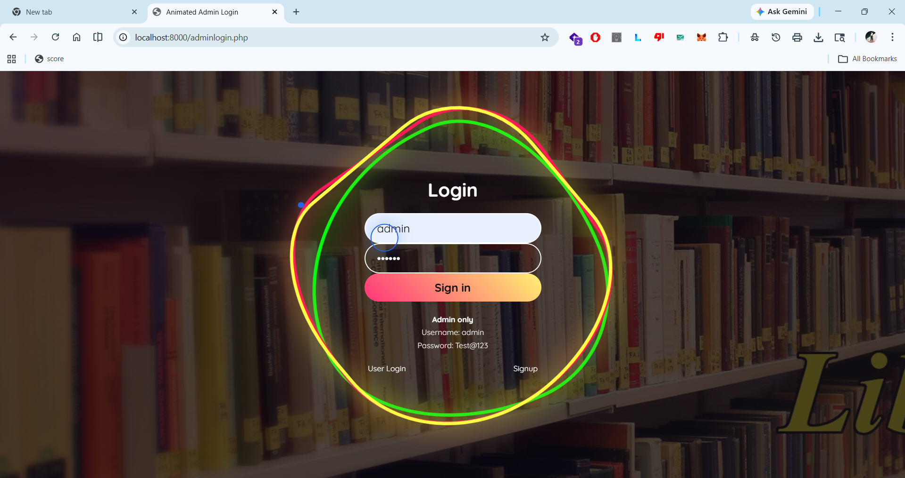
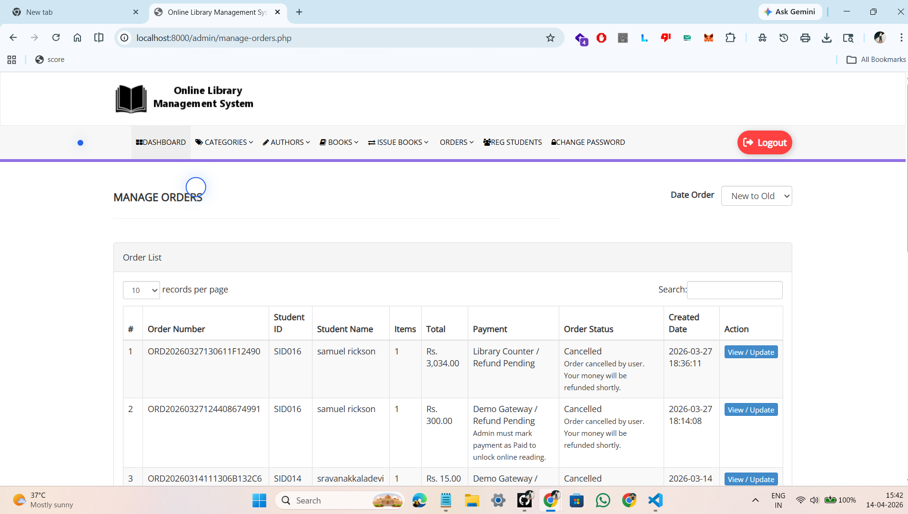
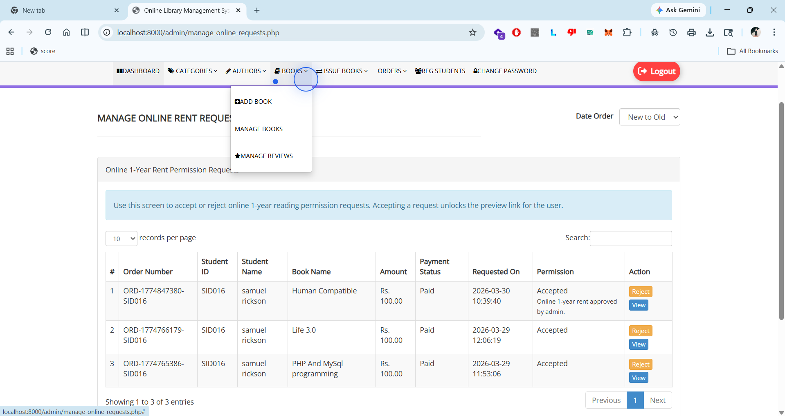
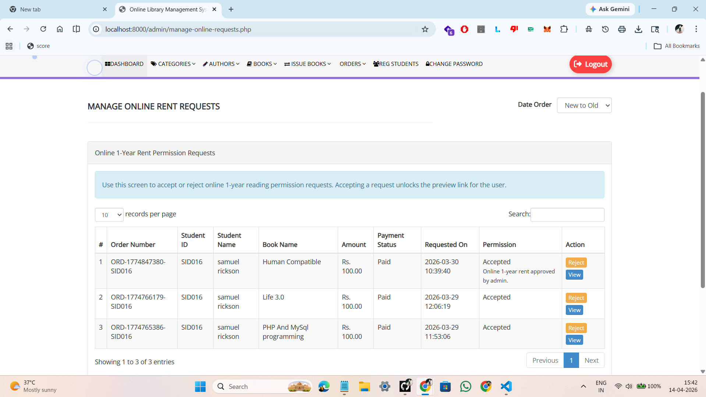

# Online Library Management System

A PHP, MySQL, and Python-based library platform for:

- home delivery book orders
- counter issue requests
- paid 1-year online reading access
- admin approval flows
- user ratings, reviews, and ML-assisted recommendations

## Main Features

- User login, signup, profile, cart, checkout, and order tracking
- Book listing, book details, issue request flow, and online preview access
- Admin management for books, authors, categories, students, issued books, requests, orders, and reviews
- Online 1-year rent request approval from admin
- Ratings and reviews with recommendation support
- Python training pipeline that exports ML recommendations for PHP to use

## Screenshots

### User Dashboard

Main user landing page after login. It gives quick access to books, orders, issued books, profile details, and other user actions.



### Book List

Shows the available library books for users to browse, search, view details, and start rental or request actions.



### Rent Book

Book rental screen where a user can review the selected book and continue with the rent or online access process.



### Payment Page

Payment step for the online book rental flow. The user can confirm payment details before submitting the request.



### Order History

Lists the user's previous and current book orders with order status information for tracking.



### Issued Books

Displays books issued to the user, including issue and return-related information.


### User Profile

User account page for viewing and managing profile details.



### Admin Dashboard

Admin home screen with shortcuts and summary cards for managing the library system.


### Admin Login

Admin authentication page used to enter the protected management panel.



### Manage Orders

Admin order management page for reviewing user orders, checking order details, and updating order status.



### Book Requests

Admin page for reviewing counter issue requests submitted by users and taking approval actions.



### Online Requests

Admin page for managing online rental or reading access requests after user payment submission.



## Project Structure

```text
Online-Library-Management-System-PHP/
|-- library/
|   |-- admin/
|   |-- assets/
|   |-- data/
|   |-- database/
|   |-- includes/
|   |-- screenshots/
|   |-- export_recommendation_data.php
|   |-- index.php
|   `-- adminlogin.php
|-- scripts/
|   |-- start_project.bat
|   |-- train_recommendations.bat
|   `-- train_recommendations.py
|-- tests/
`-- README.md
```

## Requirements

- PHP 8.0 or later
- MySQL or MariaDB
- Python 3.10 or later
- `pdo_mysql` enabled in PHP

## Database Setup

1. Create the database:

```sql
CREATE DATABASE library;
```

2. Import the main SQL dump:

```bash
mysql -u root -p library < library/database/library.sql
```

3. If needed, run any maintenance scripts such as:

```powershell
php library/fix_db.php
```

## Run the App

Fastest option:

```text
scripts\start_project.bat
```

Manual option:

```powershell
cd library
php -S localhost:8000
```

Open:

- User panel: `http://localhost:8000/`
- Admin login: `http://localhost:8000/adminlogin.php`

## ML Recommendation Flow

The recommendation setup uses Python for training and PHP for runtime display.

1. PHP exports review and rating data:

```powershell
php library/export_recommendation_data.php
```

2. Python trains the recommendation model:

```powershell
python scripts/train_recommendations.py
```

3. Or run both together:

```text
scripts\train_recommendations.bat
```

The trained model is saved to:

```text
library/data/ml_recommendations.json
```

PHP reads this file and uses it for recommendation screens, with fallback logic when rating data is still too small.

## Important Config Files

Update database credentials in:

- `library/includes/config.php`
- `library/admin/includes/config.php`

## Demo Credentials

Admin:

```text
Username: admin
Password: Test@123
```

User:

```text
Email: test@gmail.com
Password: Test@123
```

## Admin Modules

The admin panel includes:

- Manage Books
- Manage Authors
- Manage Categories
- Manage Issued Books
- Manage Book Requests
- Manage Orders
- Online Rent Requests
- Manage Reviews
- Registered Students

## Notes

- Online reading remains locked until admin approves payment.
- More user ratings improve ML recommendation quality.
- Review and recommendation data can be retrained anytime with the training script.
